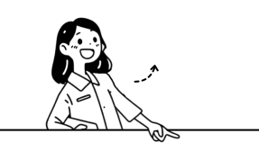

# 我听在体制内“纪检工作”的朋友劝说：“打死都不要踩这 3 个“雷区”

# 我听在体制内“纪检工作”的朋友劝说：“打死都不要踩这 3 个“雷区”

原创 点击关注👉🏻 点击关注👉🏻 田间烟火

在小说阅读器读本章

去阅读

在小说阅读器中沉浸阅读

点击上方蓝字关注我们

田间烟火🔥

大家好，我是【田间烟火🔥】～

我相信有人很多人一听到“腐败”，脑子里先冒出来的是巨额受贿、豪车豪宅。

可从近年的查处情况看，真正最常见、也最容易让人放松警惕的，往往不是大钱，而是那种看起来没啥的日常动作。

“2025年，全国查处违反中央八项规定精神问题20多万起，其中违规收送礼品礼金和违规吃喝合计超过76%”。

这个比例已经说得很直白了，问题集中在哪，不在少数人想象里的惊天大案，更多就出在饭桌上、礼品里、公家资源的边界上。

为什么这件事值得说一说，甚至要反复说？

因为不少人真会把它当成小事。

吃顿工作餐算什么，过节收盒茶叶又怎么了，顺手加点公家的油、借单位车办个私事，不就图个方便吗？

问题恰恰在这，纪律松口子，很少是一夜之间突然塌掉，往往就是从这些不痛不痒的习惯开始。

  

01

  

第 1 件事：违规吃喝

  

很多人盯着菜贵不贵，觉得不去高档酒店就没问题。

其实红线常常不在价格，而在关系。

合肥蜀山经开区邓杰义、内蒙古包头李晨伟，都涉及违规吃喝，场景也不是大家想象中的奢华饭局，有的是单位食堂，有的是培训间隙的工作餐。

这就要问一句了，食堂里吃饭也会出问题吗？

答案是，会。

考核期间，被考核单位请你吃饭，哪怕一桌菜不值多少钱，哪怕现场没谈任何事，也可能影响公正执行公务。

说白了，饭局的真正作用，不是让你吃饱，而是把公事关系慢慢变成熟人关系。

今天是顺便吃个饭，明天是不好意思拒绝，后天就可能变成办事时手一松。

有些地方已经把这类问题查得越来越细。

比如节假日前后、调研检查期间、项目验收节点，饭局更容易被盯上。

为什么偏偏这些时间敏感？

因为越临近关键节点，吃饭越可能不只是吃饭。

反过来看，确实也有正常公务接待、按标准执行的工作餐，这类情况有明确边界，关键还是看对象是谁、时点对不对、有没有超标准、会不会影响公正。

  

02

  

第 2 件事：违规收礼

  

很多人总觉得，几百块、上千块的烟酒茶卡，不至于吧？

但查处案例里，恰恰有不少就是这种小额、高频、长期。

沈丘县张新生、高亮的问题，就和过节收礼成了习惯有关，单次金额不一定夸张，可一旦形成固定往来，性质就变了。

更关键的是，纪律看重的不只是价格，还看是谁送的、为什么送、在什么时间送。

一个普通朋友送的，和管理服务对象送的，能一样吗？

平时送的，和审批前后送的，能一样吗？

不少人就是在这种自我安慰里，一点点把边界抹平了。

现在还有一种更隐蔽的做法，就是换个名目。

像这种讲课费、劳务费、咨询费，听起来都像正常报酬。

阜南县医院杨健，就曾以讲课费名义收受医药公司礼金。

包装得再像，也掩不住利益输送的本质。

你手里有审批权、采购权、推荐权，对方又恰好给你送钱送物，这里面到底是劳动报酬，还是另一种意思，不难分辨吧？

类似情况在别的行业也出现过。

前几年一些地方就查过学校采购、医院耗材、工程招投标环节里的小额往来，表面上都是节日问候、辛苦费，最后连成线一看，背后还是权力和利益交换。

这也是为什么小礼物不能只看值多少钱，更要看它是不是在试探你的底线。

  

03

  

第  
 3 件事：公私不分

  

很多人知道公车私用不行，但更隐蔽的是私车公养。

用公家的油卡、维修费用去养自己的车，账面上不显眼，实际问题一点不小。

中央纪委网站分析过30多例违规配备使用公车案例，其中20几例就涉及私车公养。

为什么这种事危险？

因为它特别像占点小便宜。

一次加油、一次过路费、一次保养，看着都不大，可次数多了，心态就变了。

今天觉得单位不差这点，明天就会觉得借企业车辆和司机也没什么。

西藏王勇、金寨某干部，就存在长期无偿借用私营企业主车辆和司机的问题。

到了这一步，已经不是方便一下，而是把公共资源和私人好处搅在一起了。

* * *

说到底，这三类问题有个共同点，都是把不该收的关系收进来了，把不该占的便利占习惯了。

真正危险的不是一次拿了多少，而是人会慢慢失去警觉。

边界一旦靠经验和人情来决定，纪律就容易变成一句空话。

还有个细节也不能忽略，不少人对大额贿赂天然警惕，对小额往来却更容易放松。

可现实中，很多严重违纪违法案件往前倒，起点并不夸张，就是一顿饭、一盒礼、一张油卡。

等关系熟了，依赖形成了，后面的事反而更难拒绝。

普通人怎么守住边界？其实只要盯住三个问题就够了：

1.  这顿饭，和我手里的职权有没有关系？
    
2.  这份礼，是不是管理服务对象送的？
    
3.  这笔车费油费，到底该谁出？
    

如果这几个问题都得靠找理由解释，那多半就已经危险了。

纪律不是专门盯着大案才存在，恰恰是为了拦住这些看似正常的小动作。

真等到问题做大了，再说自己只是顺手、顺路、过节意思一下，已经晚了。

私车公养、公车私用这类小便宜，你觉得该不该严查？

大家不妨在评论区说说你的看法，一起互相提醒、守住廉洁底线！

\[⚠️声明：本文为党风廉政警示教育科普，所有案例均已脱敏处理，仅代表作者个人观察观点，不构成执纪问责依据。请勿对号入座、过度解读，各地纪律执行以官方文件为准，仅供学习交流使用\] / 素材源于@公众号：《释然之日记》，侵联删，谢谢！

喜欢就

关注哦

动动小手

 点个赞

点在看

最好看

---

原文：https://mp.weixin.qq.com/s?__biz=MzY4NDI4OTA3NA==&mid=2247492129&idx=1&sn=453c7a3edec589fac6acc850b604dc87&chksm=f3a49f7cc4d3166abda90e19e5c2ec95ef090c76269d389d83a366d20877d9ea952f1d169f6b
